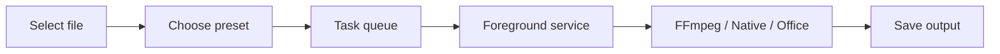

<h1 align="center">ZenConverter</h1>

  <strong>Private, local-first file conversion for Android.</strong>

  English |
  <a href="README_zh.md">中文</a>

  
  
  
  
  
  
  

  

ZenConverter is a local file converter for Android. Pick a file on your phone,
convert it on your phone, and keep it off someone else's server.

The app is built with native Kotlin and Jetpack Compose. File access goes
through Android's Storage Access Framework, and longer jobs run in a foreground
service. This is still early, so the app stays deliberately narrow: formats are
added one by one, with the rough edges written down instead of hidden.

**Note:** older phones with limited RAM may crash on large files. Even on newer
devices, very large files are still something to test carefully.

## Why Build It

Desktop users already have plenty of good open-source converters. Android feels
rougher. Many converter apps are cluttered, ad-heavy, oddly priced, or built
around uploading your file somewhere first.

ZenConverter is the local-first Android converter I wanted to use:

- no network transfer for conversion work,
- no ads, accounts, paywalls, or remote uploads,
- `INTERNET` permission is only used for manual update checks,
- no extra permissions unless the app actually needs them,
- large videos are treated as real use cases, even if that path is still rough,
- the support list lives in the public [support matrix](formats/support-matrix.md).

## Current Status

Completed items are listed first, experimental paths next, and planned work last.

| Area | Status | Notes |
| --- | --- | --- |
| Native Android shell | Done | Kotlin, Compose, Material 3, foreground service pipeline. |
| Task queue and results | Done | File basics, per-task progress and failures, compact before/after conversion details, cancellation, output sharing, and best-effort opening of the result or its location. |
| Video conversion | Done | MP4 / MKV / MOV outputs use FFmpeg true video and audio re-encoding, including MP4-to-MP4. Codec, bitrate, resolution, frame-rate, and audio options are applied to the output. |
| Video to animated GIF | Done | FFmpeg palette-based GIF export automatically uses at most the first 30 seconds, 30 fps, and 900 frames. The default short-side cap is 480 px, with 720 px and Original options. |
| Audio extraction and conversion | Done | Video audio extraction and MP3 / M4A / WAV / FLAC / WMA targets all use FFmpeg true audio re-encoding. Applicable bitrate, sample-rate, channel, and encoder checks are wired. |
| Advanced audio/video processing | Experimental | Video supports short reverse playback, fade, mirror, rotation, and frame fit/crop. Audio supports reverse playback, non-model `afftdn` noise reduction, fade, volume/mute, and echo. Reverse playback has conservative safety limits. |
| Image conversion | Done | JPG / JPEG / JFIF / JPE, PNG, WEBP, GIF, HEIC / HEIF, and ICO inputs; JPG / JFIF / PNG / WEBP / ICO / PDF outputs. GIF can use its first frame or split frames into a folder. Metadata and animation timing are not copied. |
| PDF tools | Experimental | Image/PDF conversion, PDF merge, selectable-text export to TXT / lightweight MD, plus password-based PDF encryption and decryption. No OCR or password cracking is included. |
| Office conversion | Experimental | DOCX / PPTX / XLSX can produce PDF, TXT, or lightweight MD locally. Chinese text can render with bundled CJK fonts, but layout fidelity is limited and source files are capped at 64 MiB. |
| ZIP archive handling | Planned | Added after the current conversion paths are easier to trust. |

## Architecture

The UI does not do conversion work. Each task is routed to an engine based on
the input, output, and selected mode:

- `Compatibility`: FFmpeg true re-encode path for connected video/audio targets, GIF output, and advanced processing.
- `Native`: Android platform bitmap/PDF handling where no media engine is needed.
- `Office`: Local first-pass Office rendering path for DOCX, PPTX, and XLSX.
- `SafeCache`: future fallback for file providers that cannot provide usable descriptors.

More detail lives in [docs/architecture.md](docs/architecture.md) and
[docs/technical-route.md](docs/technical-route.md).

Development setup notes are in [docs/development-setup.md](docs/development-setup.md).

## License

ZenConverter's own source code is licensed under the
[GNU Affero General Public License v3.0 or later](LICENSE).

Third-party libraries, native binaries, and bundled fonts keep their own
licenses. Details are tracked in
[docs/license-and-attribution.md](docs/license-and-attribution.md) and
[third_party/THANKS.md](third_party/THANKS.md).

## Acknowledgements

- [OhMyGPT](https://www.ohmygpt.com/) provides AI API support.
- [**ForZTN**](https://sponsorship.forztn.com/github/Jasonzhu1207/ZenConverter) provides the kernel compilation server.

## Star History

<a href="https://www.star-history.com/?repos=Jasonzhu1207%2FZenConverter&type=date&legend=top-left">
 <picture>
   <source media="(prefers-color-scheme: dark)" srcset="https://api.star-history.com/chart?repos=Jasonzhu1207/ZenConverter&type=date&theme=dark&legend=top-left&sealed_token=GKYtAachk5lOjo5_QTPLRheqRQbTo7ghEf74sSUtxDuyIVl84AIZeuMD5HD9SmJHlHYCAZRMXZAJcEgItcdaSiIPJfGjesVzujSGLqF0mxMwuXo7IbqRJNH1av_2KxhQ9d9xJXbmWoQ2cOQpDTOHmxIKs-N8wWa3aehBGBUd8jBNnJbvRKCo-RcAuEhO" />
   <source media="(prefers-color-scheme: light)" srcset="https://api.star-history.com/chart?repos=Jasonzhu1207/ZenConverter&type=date&legend=top-left&sealed_token=GKYtAachk5lOjo5_QTPLRheqRQbTo7ghEf74sSUtxDuyIVl84AIZeuMD5HD9SmJHlHYCAZRMXZAJcEgItcdaSiIPJfGjesVzujSGLqF0mxMwuXo7IbqRJNH1av_2KxhQ9d9xJXbmWoQ2cOQpDTOHmxIKs-N8wWa3aehBGBUd8jBNnJbvRKCo-RcAuEhO" />
   
 </picture>
</a>
