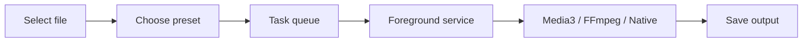

<h1 align="center">ZenConverter</h1>

<p align="center">
  <strong>Private, local-first file conversion for Android.</strong>
</p>

<p align="center">
  English |
  <a href="README_zh.md">中文</a>
</p>

<p align="center">
  
  
  
  
  
  
  
  
  
</p>

<p align="center">
  
</p>

ZenConverter is an open-source Android file converter built around a simple
rule: private files should not have to leave your phone.

It is native Kotlin plus Jetpack Compose, uses Android's Storage Access
Framework for file access, and runs long conversions through a foreground
service. It is also intentionally honest. ZenConverter is not a universal
converter yet. Each format is added one path at a time, with limits documented
before it is advertised as ready.

## Why It Exists

Most online converters are convenient until the file is private, huge, or both.
ZenConverter takes the slower, sturdier route:

- files stay on device by default,
- no ads, forced accounts, or remote-upload fallback,
- no `INTERNET` permission in the current app manifest,
- large videos are treated as normal inputs, not edge cases,
- format support is tracked in the public [support matrix](formats/support-matrix.md).

## Current Status

| Area | Status | Notes |
| --- | --- | --- |
| Native Android shell | Done | Kotlin, Compose, Material 3, foreground service pipeline. |
| No-op conversion jobs | Done | File selection, task state, progress, cancel, and failure states. |
| MP4 to MP4 | Experimental | Media3 Transformer path; still needs wider physical-device verification. |
| MKV / WEBM / AVI / 3GP / TS / MTS to MP4 | Experimental | FFmpeg-compatible stream-copy remux. It only works when the streams already fit MP4. |
| Audio / video audio to M4A | Experimental | Media3 for supported native inputs; FFmpeg copy path for compatible non-MP4 audio tracks. |
| JPG / PNG / WEBP conversion | Experimental | Native Android bitmap path. Static images only; metadata is not copied. |
| MP4 to MP3, PDF, ZIP | Planned | Tracked in the roadmap and support matrix. |

The short version: the app is ready for testing, but every experimental format
still needs real sample files and physical-device smoke tests before it should
be treated as stable.

## Architecture



The conversion engine is deliberately split from the UI. The app chooses a mode
per task:

- `FastCopy`: remux or extract without re-encoding where possible.
- `Hardware`: AndroidX Media3 / MediaCodec for common Android-supported video work.
- `Compatibility`: FFmpeg path for containers and operations Android APIs cannot cover.
- `SafeCache`: future fallback for file providers that cannot provide usable descriptors.

More detail lives in [docs/architecture.md](docs/architecture.md) and
[docs/technical-route.md](docs/technical-route.md).

## Roadmap

1. Keep hardening the first real Media3 video path.
2. Verify the first FFmpeg compatibility remux/extract path on physical devices.
3. Stabilize static image conversion.
4. Add MP4 to MP3, then PDF/image and ZIP workflows.
5. Publish signed APKs through GitHub Releases.

See [docs/roadmap.md](docs/roadmap.md) for the working plan.

## Development

The preferred workflow right now is VS Code for editing plus Android Studio
Run/Debug on a physical Android device for verification. This local setup keeps
the shared Android toolchain under `E:\AndroidDev` to avoid duplicate SDK and
Gradle caches.

Command-line smoke scripts are available when needed:

```powershell
powershell -ExecutionPolicy Bypass -File .\scripts\build-debug.ps1
powershell -ExecutionPolicy Bypass -File .\scripts\install-debug.ps1
powershell -ExecutionPolicy Bypass -File .\scripts\launch-debug.ps1
```

Setup notes are in [docs/development-setup.md](docs/development-setup.md).

## Releases

Signed APK publishing is wired through GitHub Actions. Release setup and secrets
are documented in [docs/release-automation.md](docs/release-automation.md).

Download links will point to
[GitHub Releases](https://github.com/Jasonzhu1207/ZenConverter/releases) once a
public alpha is ready.

## Support

If ZenConverter saves you time, the best support today is a star, a useful bug
report with a sample-file description, or testing on a real Android device.

Paid support and donation links are not connected yet. They will be added here
before the public alpha so the README does not send people to a dead checkout.

## Star History

[](https://star-history.com/#Jasonzhu1207/ZenConverter&Date)
