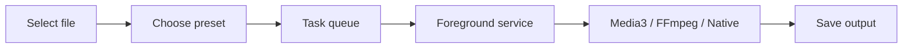

<h1 align="center">ZenConverter</h1>

  <strong>Private, local-first file conversion for Android.</strong>

  English |
  <a href="README_zh.md">中文</a>

  
  
  
  
  
  
  

  

ZenConverter is a local file converter for Android. Pick a file on your phone,
convert it on your phone, and keep it off someone else's server.

The app is built with native Kotlin and Jetpack Compose. File access goes
through Android's Storage Access Framework, and longer jobs run in a foreground
service. This is still early, so the app stays deliberately narrow: formats are
added one by one, with the rough edges written down instead of hidden.

**Note:** older phones with limited RAM may crash on large files. Even on newer
devices, very large files are still something to test carefully.

## Why Build It

Desktop users already have plenty of good open-source converters. Android feels
rougher. Many converter apps are cluttered, ad-heavy, oddly priced, or built
around uploading your file somewhere first.

ZenConverter is the local-first Android converter I wanted to use:

- no network transfer for conversion work,
- no ads, accounts, paywalls, or remote uploads,
- `INTERNET` permission is only used for manual update checks,
- no extra permissions unless the app actually needs them,
- large videos are treated as real use cases, even if that path is still rough,
- the support list lives in the public [support matrix](formats/support-matrix.md).

## Current Status

Completed items are listed first, experimental paths next, and planned work last.

| Area | Status | Notes |
| --- | --- | --- |
| Native Android shell | Done | Kotlin, Compose, Material 3, foreground service pipeline. |
| No-op conversion jobs | Done | File selection, task state, progress, cancel, and failure states. |
| MP4 to MP4 | Done | Media3 Transformer path is connected and has passed current physical-device testing. Large files should still be tested carefully. |
| MP4 to MP3 | Done | FFmpeg-compatible audio extraction and MP3 encode are connected and have passed current physical-device testing. |
| Audio format conversion | Done | MP3 / M4A / WAV / FLAC / WMA targets are connected and have passed current testing. Edge cases still depend on device codecs and the bundled FFmpeg build. |
| JPG / PNG / WEBP image conversion | Implemented | Native Android bitmap path. Static images only; metadata is not copied. |
| MKV / MOV / WEBM / AVI and similar containers to MP4 / MOV | Experimental | FFmpeg-compatible re-encode using the selected video options. |
| Image and PDF conversion | Experimental | Image to PDF uses Android `PdfDocument`; PDF to image uses Android `PdfRenderer`. It works one image/page at a time with bounded bitmap sizes. PDF output is page rasterization, not OCR or text extraction. |
| DOCX / PPTX / XLSX to PDF | Experimental | Local Office-to-PDF path for modern Office files. Chinese text can render with bundled CJK fonts, but layout fidelity is limited: formatting may be messy, and text or shapes may be shifted or overlap. |
| More video formats | Planned | Added only after the current paths are easier to trust. |

## Architecture

The UI does not do conversion work. Each task is routed to an engine based on
the input, output, and device capability:

- `FastCopy`: remux or extract without re-encoding where possible.
- `Hardware`: AndroidX Media3 / MediaCodec for common Android-supported video work.
- `Compatibility`: FFmpeg path for containers and operations Android APIs cannot cover.
- `SafeCache`: future fallback for file providers that cannot provide usable descriptors.

More detail lives in [docs/architecture.md](docs/architecture.md) and
[docs/technical-route.md](docs/technical-route.md).

Development setup notes are in [docs/development-setup.md](docs/development-setup.md).

## License

ZenConverter's own source code is licensed under the
[GNU Affero General Public License v3.0 or later](LICENSE).

Third-party libraries, native binaries, and bundled fonts keep their own
licenses. Details are tracked in
[docs/license-and-attribution.md](docs/license-and-attribution.md) and
[third_party/THANKS.md](third_party/THANKS.md).

## Acknowledgements

- [OhMyGPT](https://www.ohmygpt.com/) provides AI API support.
- [**ForZTN**](https://sponsorship.forztn.com/github/Jasonzhu1207/ZenConverter) provides the kernel compilation server.

## Star History

<a href="https://www.star-history.com/?repos=Jasonzhu1207%2FZenConverter&type=date&legend=top-left">
 <picture>
   <source media="(prefers-color-scheme: dark)" srcset="https://api.star-history.com/chart?repos=Jasonzhu1207/ZenConverter&type=date&theme=dark&legend=top-left&sealed_token=GKYtAachk5lOjo5_QTPLRheqRQbTo7ghEf74sSUtxDuyIVl84AIZeuMD5HD9SmJHlHYCAZRMXZAJcEgItcdaSiIPJfGjesVzujSGLqF0mxMwuXo7IbqRJNH1av_2KxhQ9d9xJXbmWoQ2cOQpDTOHmxIKs-N8wWa3aehBGBUd8jBNnJbvRKCo-RcAuEhO" />
   <source media="(prefers-color-scheme: light)" srcset="https://api.star-history.com/chart?repos=Jasonzhu1207/ZenConverter&type=date&legend=top-left&sealed_token=GKYtAachk5lOjo5_QTPLRheqRQbTo7ghEf74sSUtxDuyIVl84AIZeuMD5HD9SmJHlHYCAZRMXZAJcEgItcdaSiIPJfGjesVzujSGLqF0mxMwuXo7IbqRJNH1av_2KxhQ9d9xJXbmWoQ2cOQpDTOHmxIKs-N8wWa3aehBGBUd8jBNnJbvRKCo-RcAuEhO" />
   
 </picture>
</a>
