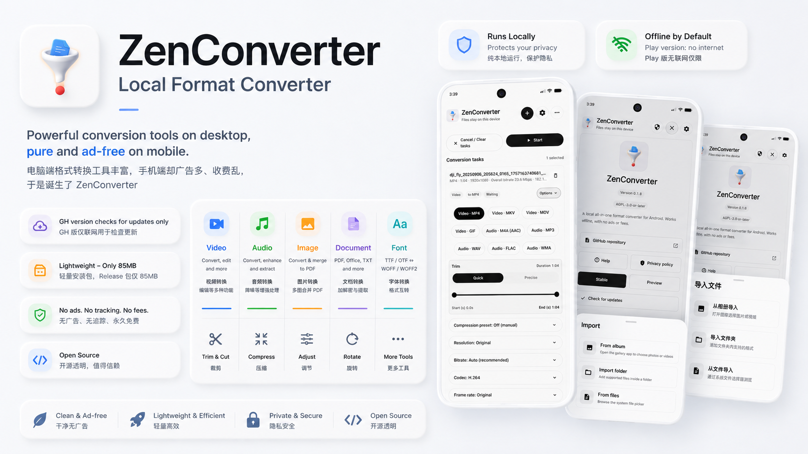
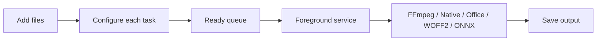

<h1 align="center">ZenConverter</h1>

  <strong>Private, local-first file conversion for Android.</strong>

  English |
  <a href="README_zh.md">中文</a>

  
  
  
  
  
  
  
  
  
  

  
  

  

ZenConverter is a local file converter for Android. Pick a file on your phone,
convert it on your phone, and keep it off someone else's server.

The app is built with native Kotlin and Jetpack Compose. File access goes
through Android's Storage Access Framework, and longer jobs run in a foreground
service. The app deliberately stays narrow: supported routes are verified on a
physical Android device, and their known limits are written down instead of
hidden.

**Note:** very large media files still need adequate free storage, memory, and
power. Keep the device available while a long foreground conversion is running.

  

## Why Build It

Desktop users already have plenty of good open-source converters. Android feels
rougher. Many converter apps are cluttered, ad-heavy, oddly priced, or built
around uploading your file somewhere first.

ZenConverter is the local-first Android converter I wanted to use:

- no network transfer for conversion work,
- no ads, accounts, paywalls, or remote uploads,
- `INTERNET` permission is only used for manual update checks and on-demand model/font downloads,
- no extra permissions unless the app actually needs them,
- large videos are treated as real use cases, even if that path is still rough,
- the support list lives in the public [support matrix](formats/support-matrix.md).

## Current Status

`Stable` routes have been verified on a physical Android device. `Beta` routes
work within the stated compatibility limits.

| Area | Status | Notes |
| --- | --- | --- |
| Native Android shell | Done | Kotlin, Compose, Material 3, foreground service pipeline. |
| Task queue and results | Done | Direct share/open import, gallery and folder batch import, same-type batch option configuration, mixed-file routing, per-file target selection, file basics, per-task progress and failures, compact before/after conversion details, cancellation, output sharing, and best-effort opening of the result or its location. |
| Video conversion & merge | Done | MP4 / MKV / MOV outputs use FFmpeg true video and audio re-encoding, including MP4-to-MP4. Video merge concatenates multiple video files with aspect-ratio normalization and audio stream handling. Codec, bitrate, resolution, frame rate, audio, draggable quick trimming & multi-point splitting, and advanced processing can be adjusted. Enabling a compression preset fixes the CRF, video quality/size strategy, and AAC audio bitrate. |
| Video to animated GIF | Done | FFmpeg palette-based GIF export automatically uses at most the first 30 seconds, 30 fps, and 900 frames. The default short-side cap is 480 px, with 720 px and Original options. |
| Audio extraction and conversion | Done | Video audio extraction and MP3 / M4A / WAV / FLAC / WMA targets all use FFmpeg true audio re-encoding. Applicable bitrate, sample-rate, channel, and encoder checks are wired. |
| Advanced audio/video processing | Stable | Video supports short reverse playback, fade, mirror, rotation, and frame fit/crop. Audio supports reverse playback, non-model `afftdn` noise reduction, fade, volume/mute, and echo. Reverse playback has conservative safety limits. |
| Image conversion | Stable / Beta | JPG / JPEG / JFIF / JPE, PNG, WEBP, GIF, HEIC / HEIF, and ICO inputs; JPG / JFIF / PNG / WEBP / ICO / PDF outputs. HEIC / HEIF remains device-decoder dependent. GIF can use its first frame or split frames into a folder. Metadata and animation timing are not copied. |
| Image super-resolution | Stable | Bilinear algorithmic upscaling (2×, 3×, 4×) and Real-ESRGAN 4× deep-learning AI models (compact general, high-quality, and anime) via ONNX Runtime. Features on-demand model download with SHA-256 verification, tiled inference, and RAM-adaptive pixel budgets. |
| Metadata safety | Stable | A separate privacy tool can inspect images/videos. JPG / JPEG / JFIF can be cleaned in place without re-encoding, with removed metadata backed up in app data for same-image restore. |
| PDF tools | Stable | Image/PDF conversion, PDF merge, PDF compression with presets (High Quality, Balanced, Small File), selectable-text export to TXT / lightweight MD, plus password-based PDF encryption and decryption. No OCR or password cracking is included. |
| Office conversion | Beta | DOCX / PPTX / XLSX can produce PDF, TXT, or lightweight MD locally. Chinese text renders with system CJK fonts or optional on-demand Noto CJK fonts, but layout fidelity is limited and source files are capped at 64 MiB. |
| Font conversion | Stable | Mutual conversion between TTF, OTF, WOFF, and WOFF2 formats. WOFF2 compression/decompression uses bundled native Google woff2 (arm64); WOFF 1.0 uses pure Kotlin zlib. Automatically matches font flavors (.ttf / .otf). |
| Subtitle & lyrics conversion | Stable | Mutual conversion between SRT, VTT, LRC, and ASS subtitle/lyrics files. LRC lyrics parsing and generation in pure Kotlin with multi-timestamp support, `[offset:]` time shifts, and GB18030/GBK Chinese fallback; SRT/VTT/ASS via FFmpeg. |

## Architecture

```mermaid
flowchart LR
    Pick["Add files"]
    Configure["Configure each task"]
    Queue["Ready queue"]
    Service["Foreground service"]
    Engine["FFmpeg / Native / Office / WOFF2 / ONNX"]
    Output["Save output"]

    Pick --> Configure --> Queue --> Service --> Engine --> Output
```

The UI does not do conversion work. Each task is routed to an engine based on
the input, output, and selected mode:

- `Compatibility`: FFmpeg true re-encode path for connected video/audio targets, GIF output, subtitles (SRT/VTT/ASS), and advanced processing.
- `Native`: Android platform bitmap/PDF handling, PDFBox-Android (PDF merge/text/security), and pure-Kotlin engines (WOFF, LRC).
- `Office`: Local first-pass Office rendering path for DOCX, PPTX, and XLSX.
- `Font / WOFF2`: Native `google/woff2` engine for WOFF2 compression and decompression.
- `AI Super-Resolution`: ONNX Runtime for local Real-ESRGAN neural network inference.
- `SafeCache`: fallback for file providers that cannot provide usable descriptors.

More detail lives in [docs/architecture.md](docs/architecture.md) and
[docs/technical-route.md](docs/technical-route.md).

Development setup notes are in [docs/development-setup.md](docs/development-setup.md).

## License

ZenConverter's own source code is licensed under the
[GNU Affero General Public License v3.0 or later](LICENSE).

Third-party libraries, native binaries, and bundled fonts keep their own
licenses. Details are tracked in
[docs/license-and-attribution.md](docs/license-and-attribution.md) and
[third_party/THANKS.md](third_party/THANKS.md).

## Acknowledgements

- [OhMyGPT](https://www.ohmygpt.com/) provides AI API support.
- [ForZTN](https://sponsorship.forztn.com/github/Jasonzhu1207/ZenConverter) provides the kernel compilation server.

## Star History

<a href="https://www.star-history.com/?repos=Jasonzhu1207%2FZenConverter&type=date&legend=top-left">
 <picture>
   <source media="(prefers-color-scheme: dark)" srcset="https://api.star-history.com/chart?repos=Jasonzhu1207/ZenConverter&type=date&theme=dark&legend=top-left&sealed_token=P3Zmgn-p92V6guzcZT8ZUwylDekOXKbOFhOleCImzz7mtVs67wn_yDBNrP0ZpawNYMYhz0WumOhO7_GJTo8zTuE8WT1iPgH4TL96SnXGWKW7AvuQP0aQ9MIhXJhDqWtOslPYbAKLRKM_p2o-kmMVitwvHCS9WRShyvQhks3hZmZ0n1tX6e91OCq-pnLk" />
   <source media="(prefers-color-scheme: light)" srcset="https://api.star-history.com/chart?repos=Jasonzhu1207/ZenConverter&type=date&legend=top-left&sealed_token=P3Zmgn-p92V6guzcZT8ZUwylDekOXKbOFhOleCImzz7mtVs67wn_yDBNrP0ZpawNYMYhz0WumOhO7_GJTo8zTuE8WT1iPgH4TL96SnXGWKW7AvuQP0aQ9MIhXJhDqWtOslPYbAKLRKM_p2o-kmMVitwvHCS9WRShyvQhks3hZmZ0n1tX6e91OCq-pnLk" />
   
 </picture>
</a>