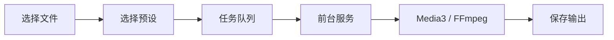

# ZenConverter 

  <a href="README.md">English</a> |
  中文

  
  
  
  
  
  
  
  

  

ZenConverter 是一个 Android 本地文件转换器。它的目标很直接：在手机上纯本地处理文件 转换格式

项目使用原生 Kotlin 加 Jetpack Compose。文件访问走 Android Storage Access
Framework，长任务放进前台服务里跑。它现在还不是万能转换器，也不会假装自己是。
每个格式都会先做一条能验证的路径，再把限制写进文档。

**❗️❗️注意：当前运存较小的老设备处理大文件时可能爆内存闪退，即使是新设备也不建议处理体积过大的文件❗️❗️**

## 为什么做它

电脑端有许多优质的开源全能格式转换工具，而手机端这一领域目前似乎还是空白的，手机端此类工具大多都存在收费混乱、UI难看、广告满天飞的情况

ZenConverter 选择本地优先：
- 没有任何网络传输，
- 没有广告、账号、收费、远程上传等，
- 当前 Android manifest 没有 `INTERNET` 权限，并且永远不会过度申请非必要权限，
- 大视频按正常使用场景处理，
- 支持范围写在公开的 [support matrix](formats/support-matrix.md) 里。

## 当前状态

| 模块 | 状态 | 说明 |
| --- | --- | --- |
| 原生 Android 外壳 | 已完成 | Kotlin、Compose、Material 3、前台服务管线。 |
| 空转换任务流 | 已完成 | 文件选择、任务状态、进度、取消、失败状态。 |
| MP4 转 MP4 | 实验性 | Media3 Transformer 路径，还需要更多真机样本验证，可能存在爆内存问题。 |
| MP4 转 MP3 | 实验性 | FFmpeg 兼容路径，提取第一条音轨并编码 MP3，还需要真机样本验证。 |
| MKV / WEBM / AVI等 转 MP4 | 实验性 | FFmpeg 兼容路径，当前是 stream-copy remux，只适合已经兼容 MP4 的音视频流。 |
| 音频格式互转 | 实验性 | 已接入 MP3 / M4A / WAV / FLAC / WMA 目标；支持范围受 Media3、FFmpeg 编码器和设备样本限制。 |
| JPG / PNG / WEBP 图片互转 | 已完成 | 使用 Android 原生 bitmap 路径。只处理静态图，不复制元数据。 |
| 更多视频格式支持 | 计划中 | -
| 文档、压缩包相关功能 | 计划中 | -

## 架构

UI 不直接做转换。每个任务会根据输入、输出和设备能力选择模式：

- `FastCopy`：尽量不重编码，只做封装转换或提取。
- `Hardware`：使用 AndroidX Media3 / MediaCodec 处理常见视频任务。
- `Compatibility`：用 FFmpeg 补上 Android API 做不了的格式和操作。
- `SafeCache`：后续用于处理无法提供可用文件描述符的文件来源。

更多细节见 [docs/architecture.md](docs/architecture.md) 和
[docs/technical-route.md](docs/technical-route.md)。
开发环境说明见 [docs/development-setup.md](docs/development-setup.md)。

## Star History

<a href="https://www.star-history.com/?repos=Jasonzhu1207%2FZenConverter&type=date&legend=top-left">
 <picture>
   <source media="(prefers-color-scheme: dark)" srcset="https://api.star-history.com/chart?repos=Jasonzhu1207/ZenConverter&type=date&theme=dark&legend=top-left&sealed_token=GKYtAachk5lOjo5_QTPLRheqRQbTo7ghEf74sSUtxDuyIVl84AIZeuMD5HD9SmJHlHYCAZRMXZAJcEgItcdaSiIPJfGjesVzujSGLqF0mxMwuXo7IbqRJNH1av_2KxhQ9d9xJXbmWoQ2cOQpDTOHmxIKs-N8wWa3aehBGBUd8jBNnJbvRKCo-RcAuEhO" />
   <source media="(prefers-color-scheme: light)" srcset="https://api.star-history.com/chart?repos=Jasonzhu1207/ZenConverter&type=date&legend=top-left&sealed_token=GKYtAachk5lOjo5_QTPLRheqRQbTo7ghEf74sSUtxDuyIVl84AIZeuMD5HD9SmJHlHYCAZRMXZAJcEgItcdaSiIPJfGjesVzujSGLqF0mxMwuXo7IbqRJNH1av_2KxhQ9d9xJXbmWoQ2cOQpDTOHmxIKs-N8wWa3aehBGBUd8jBNnJbvRKCo-RcAuEhO" />
   
 </picture>
</a>
