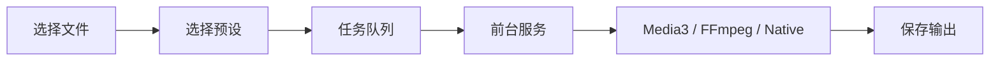

# ZenConverter 

<p align="center">
  <a href="README.md">English</a> |
  中文
</p>

<p align="center">
  
  
  
  
  
  
  
  
</p>

<p align="center">
  
</p>

ZenConverter 是一个 Android 本地文件转换器。它的目标很直接：能在手机上
处理的文件，就不要上传到别人的服务器。

项目使用原生 Kotlin 加 Jetpack Compose。文件访问走 Android Storage Access
Framework，长任务放进前台服务里跑。它现在还不是万能转换器，也不会假装自己是。
每个格式都会先做一条能验证的路径，再把限制写进文档。

## 为什么做它

在线转换器很方便，但遇到隐私文件、大视频、公司资料时，问题就来了。
ZenConverter 选择本地优先：

- 默认文件留在设备上，
- 没有广告、强制账号、远程上传兜底，
- 当前 Android manifest 没有 `INTERNET` 权限，
- 大视频按正常使用场景处理，
- 支持范围写在公开的 [support matrix](formats/support-matrix.md) 里。

## 当前状态

| 模块 | 状态 | 说明 |
| --- | --- | --- |
| 原生 Android 外壳 | 已完成 | Kotlin、Compose、Material 3、前台服务管线。 |
| 空转换任务流 | 已完成 | 文件选择、任务状态、进度、取消、失败状态。 |
| MP4 转 MP4 | 实验性 | Media3 Transformer 路径，还需要更多真机样本验证。 |
| MKV / WEBM / AVI / 3GP / TS / MTS 转 MP4 | 实验性 | FFmpeg 兼容路径，当前是 stream-copy remux，只适合已经兼容 MP4 的音视频流。 |
| 音频 / 视频提取音频到 M4A | 实验性 | 支持范围受 Media3、设备编解码器和当前 FFmpeg free tier 限制。 |
| JPG / PNG / WEBP 图片转换 | 实验性 | 使用 Android 原生 bitmap 路径。只处理静态图，不复制元数据。 |
| MP4 转 MP3、PDF、ZIP | 计划中 | 按路线图和支持矩阵继续推进。 |

一句话：现在可以开始测试，但 experimental 的格式还不能当成稳定承诺。

## 架构



UI 不直接做转换。每个任务会根据输入、输出和设备能力选择模式：

- `FastCopy`：尽量不重编码，只做封装转换或提取。
- `Hardware`：使用 AndroidX Media3 / MediaCodec 处理常见视频任务。
- `Compatibility`：用 FFmpeg 补上 Android API 做不了的格式和操作。
- `SafeCache`：后续用于处理无法提供可用文件描述符的文件来源。

更多细节见 [docs/architecture.md](docs/architecture.md) 和
[docs/technical-route.md](docs/technical-route.md)。

## 路线图

1. 继续打磨第一条 Media3 视频路径。
2. 在真机上验证第一条 FFmpeg remux / extract 兼容路径。
3. 稳定静态图片转换。
4. 增加 MP4 转 MP3，再做 PDF / 图片和 ZIP 流程。
5. 通过 GitHub Releases 发布签名 APK。

工作计划见 [docs/roadmap.md](docs/roadmap.md)。

## 开发

当前推荐用 VS Code 编辑，用 Android Studio Run/Debug 在实体 Android
设备上做验证。本机把 Android 工具链统一放在 `E:\AndroidDev`，避免重复占用
SDK 和 Gradle 缓存。

需要命令行冒烟测试时，可以从项目根目录运行：

```powershell
powershell -ExecutionPolicy Bypass -File .\scripts\build-debug.ps1
powershell -ExecutionPolicy Bypass -File .\scripts\install-debug.ps1
powershell -ExecutionPolicy Bypass -File .\scripts\launch-debug.ps1
```

环境说明见 [docs/development-setup.md](docs/development-setup.md)。

## 发布

签名 APK 的发布流程已经接入 GitHub Actions。Secrets 和触发方式见
[docs/release-automation.md](docs/release-automation.md)。

公开 alpha 准备好后，下载入口会放到
[GitHub Releases](https://github.com/Jasonzhu1207/ZenConverter/releases)。

## 支持项目

现在最有用的支持是点 star、提交带样本说明的问题，或者在实体 Android
设备上帮忙测试。

付费支持和赞助入口还没有接入。等你确定用 GitHub Sponsors、爱发电、
Buy Me a Coffee 或其他方式后，可以把链接放到这里，避免 README 先放一个
打不开的支付入口。

## Star History

<a href="https://www.star-history.com/?repos=Jasonzhu1207%2FZenConverter&type=date&legend=top-left">
 <picture>
   <source media="(prefers-color-scheme: dark)" srcset="https://api.star-history.com/chart?repos=Jasonzhu1207/ZenConverter&type=date&theme=dark&legend=top-left&sealed_token=GKYtAachk5lOjo5_QTPLRheqRQbTo7ghEf74sSUtxDuyIVl84AIZeuMD5HD9SmJHlHYCAZRMXZAJcEgItcdaSiIPJfGjesVzujSGLqF0mxMwuXo7IbqRJNH1av_2KxhQ9d9xJXbmWoQ2cOQpDTOHmxIKs-N8wWa3aehBGBUd8jBNnJbvRKCo-RcAuEhO" />
   <source media="(prefers-color-scheme: light)" srcset="https://api.star-history.com/chart?repos=Jasonzhu1207/ZenConverter&type=date&legend=top-left&sealed_token=GKYtAachk5lOjo5_QTPLRheqRQbTo7ghEf74sSUtxDuyIVl84AIZeuMD5HD9SmJHlHYCAZRMXZAJcEgItcdaSiIPJfGjesVzujSGLqF0mxMwuXo7IbqRJNH1av_2KxhQ9d9xJXbmWoQ2cOQpDTOHmxIKs-N8wWa3aehBGBUd8jBNnJbvRKCo-RcAuEhO" />
   
 </picture>
</a>
