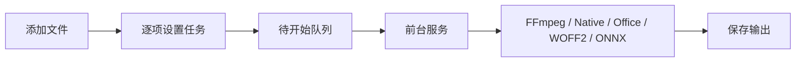

# ZenConverter

  <a href="README.md">English</a> |
  中文

  
  
  
  
  
  
  
  
  
  

  
  

  

ZenConverter 是一个 Android 本地文件转换器。选择手机里的文件，在手机上完成转换，不把文件上传到别人的服务器。

项目使用原生 Kotlin 和 Jetpack Compose。文件访问走 Android Storage Access Framework，耗时任务在前台服务中运行。项目不会假装自己是万能转换器：已支持路线均已在 Android 真机验证，限制也会直接写清楚。

**注意：** 超大媒体文件需要足够的可用存储、内存和电量。长时间前台转换期间请保持设备可用。如出现闪退等情况欢迎及时反馈。

  

## 为什么做它

桌面端已经有很多优秀的开源转换工具，但 Android 端体验仍然粗糙。很多转换类 App 广告多、收费混乱、界面臃肿，或者默认要求把文件上传到云端。

ZenConverter 想做的是一个本地优先的 Android 转换器：

- 转换过程不需要网络传输，
- 没有广告、账号、付费墙或远程上传，
- 仅申请 `INTERNET` 权限用于手动检查应用更新及按需下载 AI 模型/字体，
- 不申请不必要的权限，
- 大视频被当作真实使用场景处理，即使这条路仍然需要继续打磨，
- 支持范围公开写在 [support matrix](formats/support-matrix.md) 中。

## 当前状态

`稳定` 路线已在 Android 真机验证；`Beta` 路线可用，但仍受明确写出的兼容性边界约束。

| 模块 | 状态 | 说明 |
| --- | --- | --- |
| 原生 Android 外壳 | 已完成 | Kotlin、Compose、Material 3、前台服务任务管线。 |
| 任务队列与结果 | 已完成 | 系统分享/打开方式导入、相册与文件夹批量导入、同类文件批量配置选项、混合文件独立路由、逐文件目标设置、文件基础信息、逐任务进度和失败状态、转换前后摘要、取消、输出分享，以及尽力打开输出文件或所在位置。 |
| 视频转换与合并 | 已完成 | MP4 / MKV / MOV 输出均走 FFmpeg 视频与音频真重新编码，包含 MP4 转 MP4。视频合并支持按顺序拼接多个视频，自动适配异构分辨率与补充静音轨。可调整编码、码率、分辨率、帧率、音频、可视化拖拽快捷裁剪与多段分割、高级处理。开启压缩预设会固定 CRF、视频质量/体积策略及 AAC 音频码率。 |
| 视频转动图 GIF | 已完成 | 使用 FFmpeg 调色板路线，自动取前 30 秒，最多 30 fps、900 帧；默认短边 480 px，可选 720 px 或原始尺寸。 |
| 音频提取与互转 | 已完成 | 视频音频提取和 MP3 / M4A / WAV / FLAC / WMA 目标均走 FFmpeg 真重新编码；已接入适用的码率、采样率、声道和编码器检查。 |
| 音视频高级处理 | 稳定 | 视频支持短视频倒放、淡入淡出、镜像、旋转和画幅适配/裁剪；音频支持倒放、无模型 `afftdn` 降噪、淡入淡出、音量/静音和回音。倒放有保守的安全限制。 |
| 视频 AI 补帧插帧 | 实验性 | 基于 Tencent NCNN 与 Vulkan GPU 加速的 RIFE 深度学习 2× 补帧（如 30fps -> 60fps）。支持按需下载模型并校验 SHA-256，内置 1080p+ 自适应显存优化。由于移动端芯片 GPU 驱动与显存调度差异，目前处于实验阶段。 |
| 图片转换 | 稳定 / Beta | 支持 JPG / JPEG / JFIF / JPE、PNG、WEBP、GIF、HEIC / HEIF、ICO 输入，以及 JPG / JFIF / PNG / WEBP / ICO / PDF 输出。HEIC / HEIF 仍受设备解码器能力影响。GIF 可转首帧或拆帧到文件夹；不复制元数据和动画时序。 |
| 图片超分辨率 | 稳定 | 支持双线性插值算法超分（2×、3×、4×）以及基于 ONNX Runtime 的 Real-ESRGAN 4× AI 深度学习超分模型（通用模型、高画质模型、动漫模型等）。支持按需下载模型并校验 SHA-256，采用瓦片式分块推理与基于设备内存的动态像素预算，避免 OOM。 |
| 元数据安全 | 稳定 | 独立隐私工具可查看图片/视频元数据。JPG / JPEG / JFIF 可不重编码原地清理，被移除的元数据会备份到应用数据目录，支持同一张图恢复。 |
| PDF 工具 | 稳定 | 图片/PDF 互转、PDF 合并、PDF 智能压缩（高画质/均衡/小体积）、可选择文本导出 TXT / 轻量 MD，以及基于密码的 PDF 加密和解密。不包含 OCR 或密码破解。 |
| Office 转换 | Beta | DOCX / PPTX / XLSX 可在本地输出 PDF、TXT 或轻量 MD。中文默认使用系统 CJK 字体渲染，也可在设置中按需下载高保真 Noto CJK 字体；无版式完全保真承诺，源文件上限为 64 MiB。 |
| 字体转换 | 稳定 | 支持 TTF、OTF、WOFF、WOFF2 字体格式互转。WOFF2 编解码使用内置 Google woff2 原生库（arm64），WOFF 1.0 使用纯 Kotlin zlib 实现；按字体轮廓自动匹配 .ttf / .otf 输出扩展名。 |
| 歌词与字幕转换 | 稳定 | 支持 SRT、VTT、LRC、ASS 格式互转。LRC 歌词使用纯 Kotlin 解析与生成，支持多时间戳、`[offset:]` 偏移标签与 GB18030/GBK 编码回退；SRT/VTT/ASS 走 FFmpeg 字幕管线。 |

## 架构

```mermaid
flowchart LR
    Pick["添加文件"]
    Configure["逐项设置任务"]
    Queue["待开始队列"]
    Service["前台服务"]
    Engine["FFmpeg / Native / Office / WOFF2 / ONNX"]
    Output["保存输出"]

    Pick --> Configure --> Queue --> Service --> Engine --> Output
```

UI 不直接做转换。每个任务会根据输入、输出和所选模式选择引擎：

- `Compatibility`：已接入音视频目标、GIF 输出、字幕转换（SRT/VTT/ASS）和音视频高级处理均走 FFmpeg 路线。
- `Native`：用 Android 平台 API 处理图片、PDF，结合 PDFBox-Android（合并/文本/安全）及纯 Kotlin 引擎（WOFF、LRC）。
- `Office`：用本地初版 Office 渲染路线处理 DOCX、PPTX 和 XLSX。
- `Font / WOFF2`：通过内置 `google/woff2` 原生库处理 WOFF2 字体压缩与解压。
- `AI Super-Resolution`：基于 ONNX Runtime 在本地运行 Real-ESRGAN 神经网络超分推理。
- `AI Frame Interpolation`：基于 Tencent NCNN 与 Vulkan GPU 加速在本地运行 RIFE 2× 视频补帧推理。
- `SafeCache`：后续用于处理无法提供可用文件描述符的文件来源。

更多细节见 [docs/architecture.md](docs/architecture.md) 和
[docs/technical-route.md](docs/technical-route.md)。

开发环境说明见 [docs/development-setup.md](docs/development-setup.md)。

## 许可证

ZenConverter 自有源码基于
[GNU Affero General Public License v3.0 or later](LICENSE) 发布。

第三方库和原生二进制文件仍保留各自许可证。详细记录见
[docs/license-and-attribution.md](docs/license-and-attribution.md) 和
[third_party/THANKS.md](third_party/THANKS.md)。

## 鸣谢

- [OhMyGPT](https://www.ohmygpt.com/) 提供 AI API 支持。
- [ForZTN](https://sponsorship.forztn.com/github/Jasonzhu1207/ZenConverter) 提供内核编译服务器支持。

## Star History

<a href="https://www.star-history.com/?repos=Jasonzhu1207%2FZenConverter&type=date&legend=top-left">
 <picture>
   <source media="(prefers-color-scheme: dark)" srcset="https://api.star-history.com/chart?repos=Jasonzhu1207/ZenConverter&type=date&theme=dark&legend=top-left&sealed_token=P3Zmgn-p92V6guzcZT8ZUwylDekOXKbOFhOleCImzz7mtVs67wn_yDBNrP0ZpawNYMYhz0WumOhO7_GJTo8zTuE8WT1iPgH4TL96SnXGWKW7AvuQP0aQ9MIhXJhDqWtOslPYbAKLRKM_p2o-kmMVitwvHCS9WRShyvQhks3hZmZ0n1tX6e91OCq-pnLk" />
   <source media="(prefers-color-scheme: light)" srcset="https://api.star-history.com/chart?repos=Jasonzhu1207/ZenConverter&type=date&legend=top-left&sealed_token=P3Zmgn-p92V6guzcZT8ZUwylDekOXKbOFhOleCImzz7mtVs67wn_yDBNrP0ZpawNYMYhz0WumOhO7_GJTo8zTuE8WT1iPgH4TL96SnXGWKW7AvuQP0aQ9MIhXJhDqWtOslPYbAKLRKM_p2o-kmMVitwvHCS9WRShyvQhks3hZmZ0n1tX6e91OCq-pnLk" />
   
 </picture>
</a>
