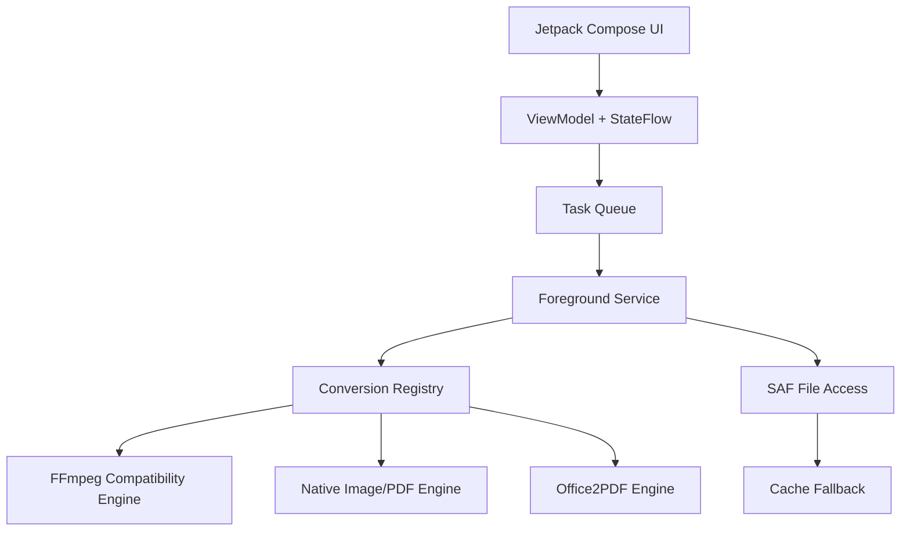

# Architecture

ZenConverter is native Android first. The app should remain useful without a
server, account, or network permission.

## Core Ideas

- UI is not the conversion engine. It only describes jobs and shows state.
- The registry chooses an engine based on input, output, and mode.
- FFmpeg handles connected video/audio conversion and advanced processing.
- Native Android APIs handle bitmap image conversion, image/PDF paths, and
  metadata work where they are reliable enough.
- The experimental Office path is isolated behind its JNI renderer.
- The app must stream or pass file descriptors whenever possible.
- Copying large files to cache is a fallback, not the default path.
