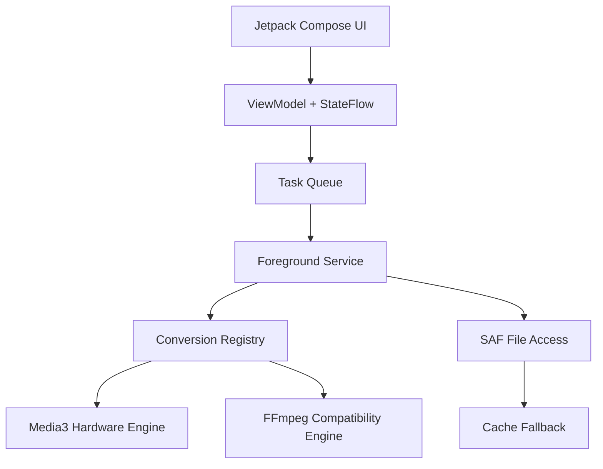

# Architecture

ZenConverter is native Android first. The app should remain useful without a
server, account, or network permission.

## Core Ideas

- UI is not the conversion engine. It only describes jobs and shows state.
- The registry chooses an engine based on input, output, and mode.
- Media3 handles common hardware-accelerated video work.
- FFmpeg handles compatibility tasks that Android APIs cannot cover.
- The app must stream or pass file descriptors whenever possible.
- Copying large files to cache is a fallback, not the default path.
